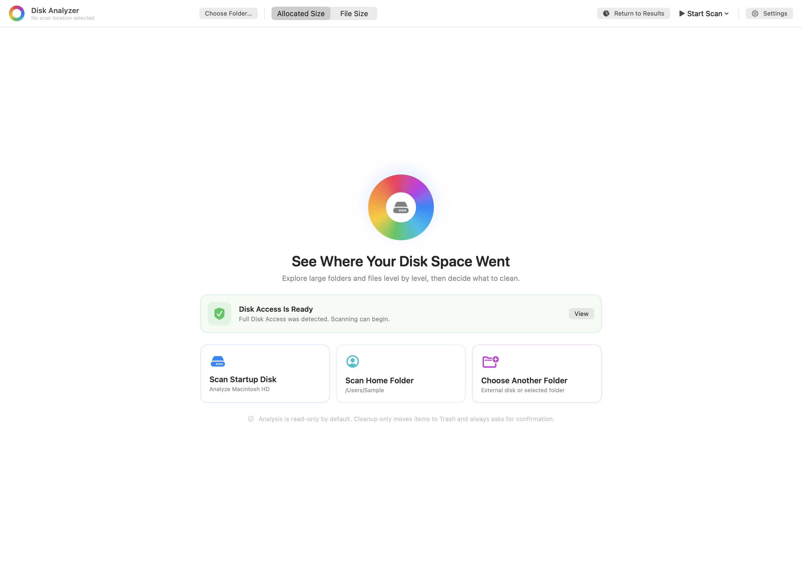
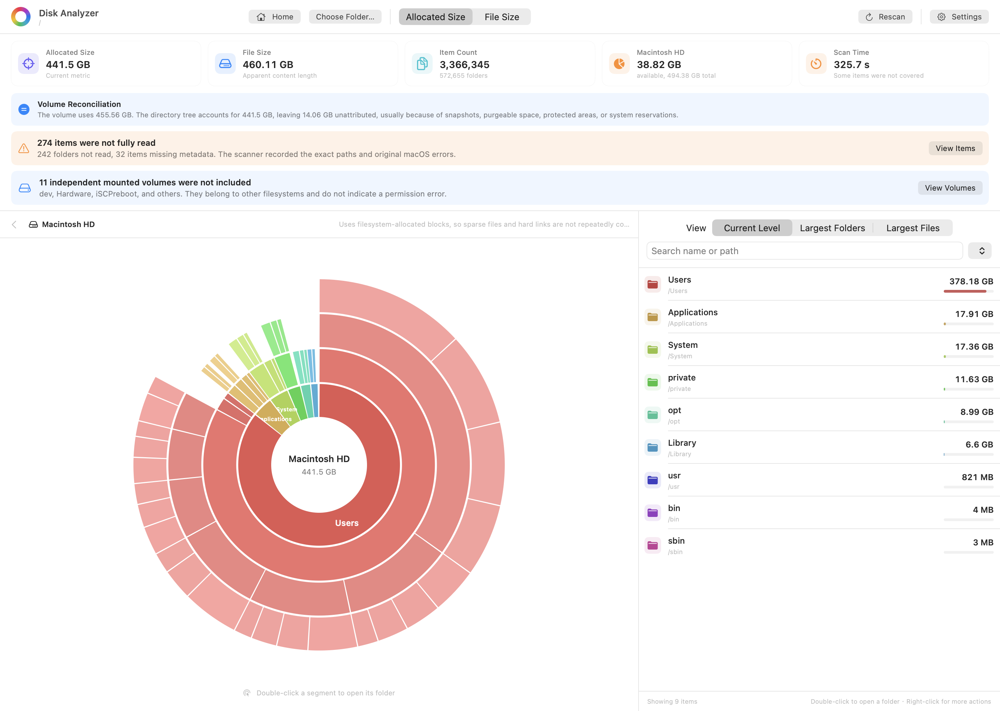

# Disk Analyzer

**English** | [简体中文](README.zh-CN.md)

Disk Analyzer is a native macOS utility for finding where disk space is going. It combines an interactive multi-ring sunburst chart with sortable directory and file rankings, and distinguishes allocated disk space from logical file size so sparse files and hard links are not presented as deceptively simple totals.

The app can scan the startup disk, the current user's home directory, an external volume, or any selected folder. Results stay on the Mac and can be explored without modifying files; cleanup actions use the system Trash and require confirmation.

## Interface Preview

**English screenshots** | [简体中文截图](README.zh-CN.md#界面预览)

### Start Screen



### Analysis Results



> Both screenshots are rendered from the real SwiftUI interface using built-in sample data. Names, paths, sizes, counts, diagnostics, and scan duration are demonstrations and do not come from a user's disk.

## Install and Run

Building the latest source locally is recommended. A prebuilt Apple Silicon DMG is also available.

> [!IMPORTANT]
> The downloadable app uses an ad-hoc signature and is not notarized by Apple. macOS may warn that it cannot verify the developer. An ad-hoc signature also changes whenever the executable changes, so after replacing the app with a newer build you may need to remove the old DiskAnalyzer entry from **System Settings → Privacy & Security → Full Disk Access**, then add `/Applications/DiskAnalyzer.app` again.

### Recommended: Build from Source

Requirements: macOS 13 or later and the Swift toolchain included with Xcode or Xcode Command Line Tools.

```bash
git clone https://github.com/daniel-weih/disk-analyzer.git
cd disk-analyzer
swift run
```

Build an application bundle:

```bash
./scripts/package_app.sh
open dist/DiskAnalyzer.app
```

Build and verify a DMG:

```bash
./scripts/package_dmg.sh
open dist/DiskAnalyzer-2.2.0-arm64.dmg
```

### Download the DMG

**[Download Disk Analyzer 2.2.0 for Apple Silicon](https://github.com/daniel-weih/disk-analyzer/releases/download/v2.2.0/DiskAnalyzer-2.2.0-arm64.dmg)**

Drag `DiskAnalyzer.app` to **Applications**, eject the installer image, and launch the copy in Applications. If Gatekeeper blocks the first launch, Control-click the app in Finder and choose **Open**.

## Features

- Interactive multi-level sunburst chart with double-click drill-down
- In-app Simplified Chinese and English switching, remembered across launches
- Rankings for the current level, largest directories, and largest files
- Search, size/name sorting, Finder reveal, and safe move-to-Trash actions
- Startup disk, home directory, external volume, and arbitrary-folder scans
- A Home button that preserves the most recent result and drill-down position
- Explicit scan-coverage diagnostics instead of silently treating unreadable paths as zero bytes
- Separate reporting for skipped mounted volumes and filesystem boundaries
- Volume-capacity reconciliation that keeps snapshots, purgeable space, and APFS shared extents distinct from ordinary directory totals

## Disk Accounting

Disk Analyzer exposes two metrics:

- **Allocated size** uses `lstat(2)` and `st_blocks × 512`, matching the accounting model of `du -sk`. Sparse files count only allocated blocks, and the same hard-linked inode is counted once.
- **File size** uses `st_size`, the apparent length of file contents. Sparse files, hard links, and APFS clones can make this total larger than physical usage.

Scans do not cross filesystem boundaries by default. Device and inode identities are used to avoid duplicate APFS firmlink paths, while understandable paths such as `/Users` and `/Applications` are preferred in the result tree.

APFS snapshots, purgeable space, and shared clone extents cannot always be attributed precisely to an ordinary directory hierarchy. The app therefore presents scanned files and volume capacity as related but separate evidence.

## Privacy and Safety

- No network requests, analytics SDKs, telemetry, accounts, or cloud storage
- Scan results remain in process memory and are not persisted as a browsing history
- Scanning reads names, paths, and filesystem metadata; it does not read file contents
- Cleanup uses the system Trash, remains recoverable, and requires confirmation
- System roots such as `/System` and other protected top-level locations cannot be moved to Trash from the app

## Full Disk Access

macOS does not allow an app to grant itself Full Disk Access. Disk Analyzer guides the user to the correct System Settings page before a broad scan and verifies access using a read-only probe of a protected TCC database. Merely opening Settings or restarting the app is not treated as proof that access was granted.

If drag-and-drop into the Full Disk Access list is unavailable, use the `+` button in System Settings and choose `/Applications/DiskAnalyzer.app`. Stable Apple Development or Developer ID signing prevents the permission identity from changing on every build:

```bash
DISK_ANALYZER_SIGN_IDENTITY="Developer ID Application: Example (TEAMID)" \
  ./scripts/package_dmg.sh
```

## Development and Validation

```bash
swift build
./scripts/test.sh
```

Regenerate the English and Simplified Chinese README screenshots:

```bash
./scripts/capture_readme_images.sh
```

The test suite covers allocated/logical accounting, hard-link deduplication, sparse files, symbolic links, omitted-file aggregation, unreadable-directory diagnostics, mounted-volume classification, permission-state handling, home/result navigation, compact sunburst layout, and privacy-safe UI rendering.

## License

Disk Analyzer is available under the [MIT License](LICENSE).
