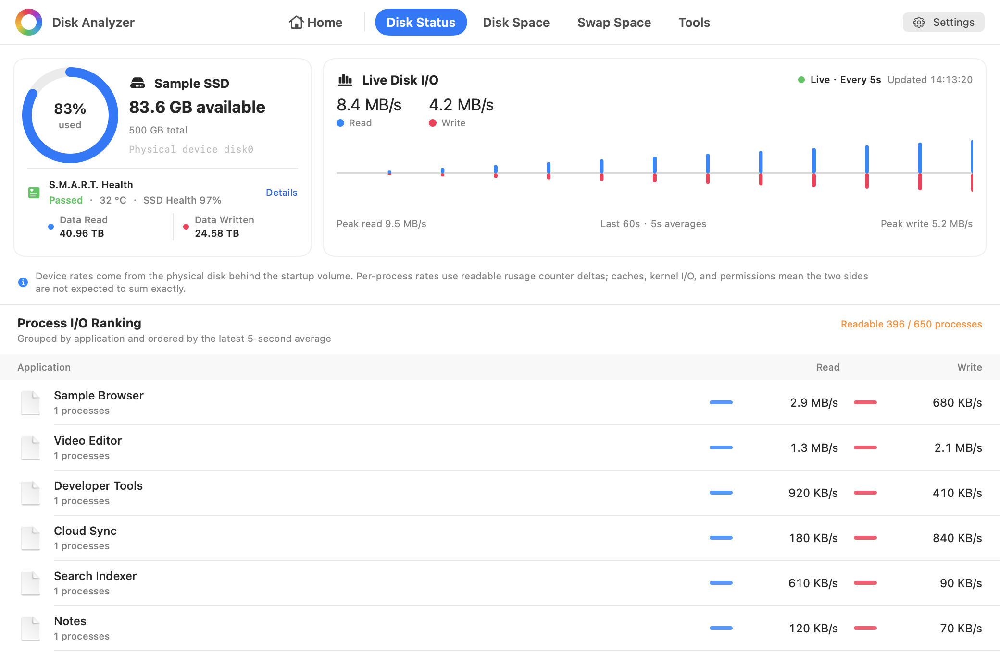
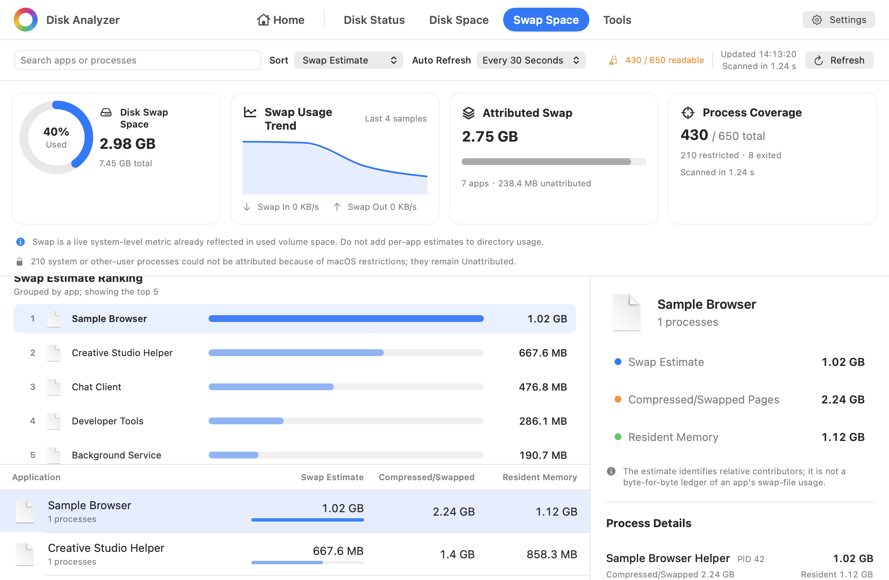

# Disk Analyzer

**English** | [简体中文](README.zh-CN.md)

Disk Analyzer is a native macOS utility for understanding both current disk activity and where disk space is going. Its live disk-status dashboard shows startup-volume capacity, physical-device throughput, a 60-second history, and readable per-application I/O. Its space analyzer combines an interactive multi-ring sunburst chart with sortable directory and file rankings, and distinguishes allocated disk space from logical file size so sparse files and hard links are not presented as deceptively simple totals.

The same app also includes a separate swap-space analysis mode. It reads the real system swap total, tracks swap activity, and conservatively attributes compressed or swapped pages to applications and their processes without mixing those estimates into directory totals.

The app can scan the startup disk, the current user's home directory, an external volume, or any selected folder. Results stay on the Mac and can be explored without modifying files. Cleanup items are reviewed in a Collector, wait through a cancellable five-second countdown, and then move to the system Trash.

## Interface Preview

**English screenshots** | [简体中文截图](README.zh-CN.md#界面预览)

### Start Screen


### Analysis Results


### Disk Status



### Swap Space Analysis



> All screenshots are rendered from the real SwiftUI interface using built-in sample data. Names, paths, sizes, counts, diagnostics, and scan duration are demonstrations and do not come from a user's disk.

## Install and Run

Build the latest source locally using the steps below.

> [!IMPORTANT]
> The packaging scripts use an ad-hoc signature by default and do not notarize the app with Apple. macOS may warn that it cannot verify the developer. An ad-hoc signature also changes whenever the executable changes, so after replacing the app with a newer build you may need to remove the old DiskAnalyzer entry from **System Settings → Privacy & Security → Full Disk Access**, then add `/Applications/DiskAnalyzer.app` again.

### Recommended: Build from Source

Requirements: macOS 13 or later and the Swift toolchain included with Xcode or Xcode Command Line Tools.

```bash
git clone https://github.com/daniel-weih/disk-analyzer.git
cd disk-analyzer
swift run
```

Build an application bundle:

```bash
./scripts/package_app.sh
open dist/DiskAnalyzer.app
```

Build and verify a DMG:

```bash
./scripts/package_dmg.sh
open dist/DiskAnalyzer-2.2.0-arm64.dmg
```

Drag `DiskAnalyzer.app` to **Applications**, eject the installer image, and launch the copy in Applications. If Gatekeeper blocks the first launch, Control-click the app in Finder and choose **Open**.

## Features

- Live startup-disk status with capacity, physical-device read/write throughput, a 60-second chart, and readable per-application I/O ranking
- Optional local `smartctl` integration for NVMe health, temperature, endurance, lifetime reads/writes, power history, unsafe shutdowns, and media/error counters
- Interactive multi-level sunburst chart with double-click drill-down
- In-app Simplified Chinese and English switching, remembered across launches
- Rankings for the current level, largest directories, and largest files
- Search, size/name sorting, Finder reveal, and safe move-to-Trash actions
- Startup disk, home directory, external volume, and arbitrary-folder scans
- A Home button that preserves the most recent result and drill-down position
- Explicit scan-coverage diagnostics instead of silently treating unreadable paths as zero bytes
- Separate reporting for skipped mounted volumes and filesystem boundaries
- Volume-capacity reconciliation that keeps snapshots, purgeable space, and APFS shared extents distinct from ordinary directory totals
- Separate swap-space dashboard with real system usage, recent activity, conservative application attribution, process details, search, sorting, and auto-refresh
- Large File Finder in Tools with a selectable folder, adjustable threshold (100 MB by default), descending size order, and Finder reveal
- Similar Image Finder in Tools with a choice between conservative near-duplicate matching and Apple Vision Feature Print content matching

## Disk Accounting

Disk Analyzer exposes two metrics:

- **Allocated size** uses `lstat(2)` and `st_blocks × 512`, matching the accounting model of `du -sk`. Sparse files count only allocated blocks, and the same hard-linked inode is counted once.
- **File size** uses `st_size`, the apparent length of file contents. Sparse files, hard links, and APFS clones can make this total larger than physical usage.

Scans do not cross filesystem boundaries by default. Device and inode identities are used to avoid duplicate APFS firmlink paths, while understandable paths such as `/Users` and `/Applications` are preferred in the result tree.

APFS snapshots, purgeable space, and shared clone extents cannot always be attributed precisely to an ordinary directory hierarchy. The app therefore presents scanned files and volume capacity as related but separate evidence.

The Large File Finder compares the logical size of regular files against a decimal-MB threshold (1 MB = 1,000,000 bytes) and includes only files strictly larger than that threshold. It does not follow symbolic links or cross separately mounted volumes. Unreadable folders and unavailable metadata are reported explicitly instead of being misrepresented as a clean result. Both logical size and filesystem-reported allocated size are shown because sparse, compressed, or cloned files can differ between those measurements.

The Similar Image Finder offers two explicit matching methods. **Near-duplicate** derives a local 32 × 32 perceptual feature from the first frame and combines structural hashes, pixel differences, and aspect ratio; its conservative 90% default targets the same image after resizing, recompression, or format conversion. **Apple Vision** uses a pinned Revision 1 [Feature Print](https://developer.apple.com/documentation/vision/analyzing-image-similarity-with-feature-print) and Apple's distance calculation to find similar content or scenes. For readability, the interface linearly maps the supported Vision distance range of 0...50 to a 100%...0% similarity scale, where a higher percentage means closer content. This percentage is only a presentation scale—not an Apple confidence or probability—and matching still uses the original unrounded Vision distance. The adjustable 75% default corresponds to a maximum distance of 12.5 and is an application preset calibrated against controlled examples, not a universal cutoff published by Apple. Vision comparisons are exhaustive within the ungrouped candidates, favoring complete threshold results over speed.

In both methods, every result directly meets the active threshold against the marked reference image; transitive matches are not used to inflate a group. The scan does not follow symbolic links or cross separately mounted volumes, and reports damaged, restricted, or undecodable candidates separately.

## Disk Status Accounting

The live read/write chart samples every five seconds, using cumulative byte counters from the `IOBlockStorageDriver` behind the startup volume and dividing consecutive differences by the actual measured interval. The chart retains only the latest 60 seconds. On APFS, this physical-device rate can include I/O from other volumes sharing the same device.

The application ranking independently uses the same five-second sampling interval with consecutive `proc_pid_rusage` I/O-counter differences for readable processes and groups application helpers under their outer `.app` bundle. PID start times prevent a reused PID from inheriting an older process's counters. Filesystem caching, kernel I/O, short-lived processes, and macOS permissions mean application rows are diagnostic attribution and are not expected to add up exactly to the physical-device rate. An empty ranking means no attributable process I/O occurred during that interval; it is not reported as a probe error.

If `smartctl` is installed in a standard Homebrew or MacPorts location, the capacity card also reads `smartctl --health --attributes --json` for the whole physical startup disk. It refreshes at most once per minute and never invokes `sudo`. When the tool is missing, the card shows installation guidance, copyable Homebrew/MacPorts commands, and a recheck action without executing installation itself. Launch, permission, unsupported-device, timeout, and malformed-output failures are reported explicitly. The capacity card's “SSD Health” is `100 - percentage_used`, clamped to 0–100%. NVMe data units are converted using the specification's 512,000 bytes per unit while the original unit counts remain visible in Details.

## Swap Accounting

macOS exposes exact system-level swap usage through `vm.swapusage`, but it does not expose a public byte-for-byte ledger assigning swap files to individual processes. The swap dashboard therefore reads each accessible process's compressed/swapped region pages and scales them conservatively against the real system total. Shared mappings and inaccessible processes remain bounded or explicitly unattributed.

Application swap values are estimates for identifying relative contributors. They must not be added to directory usage: system swap is already reflected in the volume's used capacity. The process-region diagnostic interface is not suitable for Mac App Store sandbox distribution and may leave protected system or other-user processes unreadable.

## Privacy and Safety

- No network requests, analytics SDKs, telemetry, accounts, or cloud storage
- Scan results remain in process memory and are not persisted as a browsing history
- Disk-space scans read names, paths, and filesystem metadata; they do not read file contents
- Large-file scans read paths and sizes only; matching files are not opened, uploaded, or modified
- Similar-image scans read and downsample images one at a time on this Mac; images are not uploaded or modified, and perceptual or Vision Feature Print data remains in process memory and is not written to disk
- Disk status reads volume/device counters plus process names, executable paths, and cumulative I/O counters; it does not read file or process-memory contents
- Optional SMART integration parses only health counters returned by `smartctl`; it does not request or retain the disk model or serial number
- Swap analysis reads system memory counters plus process names, executable paths, task sizes, and virtual-memory region metadata; it does not read process memory contents
- Cleanup is reviewed in the Collector, has a cancellable five-second countdown, and moves items to the recoverable system Trash
- System roots such as `/System` and other protected top-level locations cannot be moved to Trash from the app

## Full Disk Access

macOS does not allow an app to grant itself Full Disk Access. Disk Analyzer guides the user to the correct System Settings page before a broad scan and verifies access using a read-only probe of a protected TCC database. Merely opening Settings or restarting the app is not treated as proof that access was granted.

If drag-and-drop into the Full Disk Access list is unavailable, use the `+` button in System Settings and choose `/Applications/DiskAnalyzer.app`. Stable Apple Development or Developer ID signing prevents the permission identity from changing on every build:

```bash
DISK_ANALYZER_SIGN_IDENTITY="Developer ID Application: Example (TEAMID)" \
  ./scripts/package_dmg.sh
```

## Development and Validation

```bash
swift build
./scripts/test.sh
```

Regenerate the English and Simplified Chinese README screenshots:

```bash
./scripts/capture_readme_images.sh
```

The test suite covers allocated/logical accounting, hard-link deduplication, sparse files, symbolic links, large-file threshold boundaries and ordering, near-duplicate and Apple Vision image matching, damaged-image diagnostics, omitted-file aggregation, unreadable-directory diagnostics, mounted-volume classification, permission-state handling, disk I/O deltas and PID reuse, SMART JSON/error handling, live disk and swap probes, swap-attribution bounds, cancellation, home/result navigation, compact layouts, and privacy-safe UI rendering.

## License

Disk Analyzer is available under the [MIT License](LICENSE).
