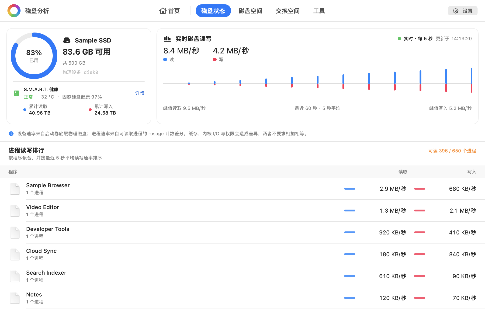
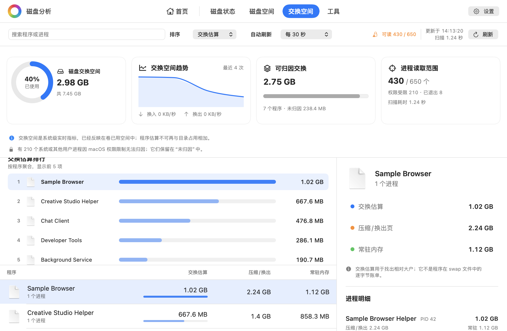

# 磁盘分析

[English](README.md) | **简体中文**

Disk Analyzer 是一款原生 macOS 磁盘分析工具，既能查看磁盘此刻在做什么，也能找出空间去了哪里。“磁盘状态”页面展示启动卷容量、底层物理磁盘实时读写、60 秒趋势和可读取程序的 I/O 排行；空间分析则把可交互的多层圆环图与目录、文件排行结合起来，并明确区分“磁盘实际分配空间”和“文件表面大小”，避免把稀疏文件、硬链接等情况展示成看似精确、实际却容易误解的单一总数。

同一个 App 现在还提供独立的“交换空间”分析模式：读取系统真实 swap 总量和变化趋势，并把压缩/换出页保守归因到程序及其进程，但绝不会把这些估算重复加入目录占用。

应用可扫描启动磁盘、当前用户的个人目录、外置磁盘或任意文件夹。所有结果只留在本机；浏览分析结果不会修改文件。清理项目会先进入清理列表供核对，经过可取消的 5 秒倒计时后再移入系统废纸篓。

## 界面预览

[English screenshots](README.md#interface-preview) | **简体中文截图**

### 首页


### 分析结果


### 磁盘状态



### 交换空间分析



> 以上截图均由真实 SwiftUI 界面配合内置演示数据渲染。图中的名称、路径、大小、数量、诊断信息和扫描耗时均为演示内容，不来自任何用户的磁盘。

## 安装与运行

请按以下步骤从最新源码在本机构建。

> [!IMPORTANT]
> 打包脚本默认使用 ad-hoc 临时签名，且不会进行 Apple 公证，macOS 可能提示无法验证开发者。临时签名还会在可执行文件变化后生成新的代码身份，因此覆盖安装新版本后，可能需要先在“系统设置 → 隐私与安全性 → 完全磁盘访问权限”中删除旧的 DiskAnalyzer 条目，再重新添加 `/Applications/DiskAnalyzer.app`。

### 推荐：从源码构建

要求：macOS 13 或更高版本，以及 Xcode 或 Xcode Command Line Tools 附带的 Swift 工具链。

```bash
git clone https://github.com/daniel-weih/disk-analyzer.git
cd disk-analyzer
swift run
```

打包应用：

```bash
./scripts/package_app.sh
open dist/DiskAnalyzer.app
```

打包并校验 DMG：

```bash
./scripts/package_dmg.sh
open dist/DiskAnalyzer-2.2.0-arm64.dmg
```

把 `DiskAnalyzer.app` 拖入“应用程序”，推出安装镜像，再从“应用程序”启动。若首次启动被 Gatekeeper 拦截，可在 Finder 中按住 Control 点按应用并选择“打开”。

## 当前能力

- 实时磁盘状态：启动卷容量、底层物理设备读写速率、60 秒趋势和可读取程序的 I/O 排行
- 可选的本机 `smartctl` 集成，展示 NVMe 健康、温度、寿命、累计读写、通电记录、非正常关机及介质/错误计数
- 可交互的多层圆环图，双击色块逐层进入目录
- 可在应用设置中即时切换简体中文和英文，并记住选择
- 当前层级、最大目录、最大文件三种排行范围
- 名称或路径搜索、大小/名称排序、Finder 定位和安全移入废纸篓
- 支持启动磁盘、个人目录、外置磁盘和任意文件夹
- 返回首页时保留最近一次分析结果和目录下钻位置
- 明确展示未读取目录和元数据错误，不把未覆盖路径静默记成 0
- 将主动跳过的挂载卷、文件系统边界与权限问题分开说明
- 单独展示卷容量对账，避免把快照、可清除空间和 APFS 共享块伪装成普通目录统计
- 独立的交换空间面板，展示系统真实用量、近期变化、程序保守归因、进程明细、搜索、排序和自动刷新
- 工具页内置大文件扫描，可选择目录并调整阈值（默认 100 MB），按文件大小排序并在 Finder 中定位
- 工具页内置相似图片扫描，可在“近似副本”和 Apple Vision Feature Print 内容识别之间选择

## 统计口径

Disk Analyzer 提供两种口径：

- **实际占用**：使用 `lstat(2)` 返回的 `st_blocks × 512`，与 `du -sk` 的统计模型一致。稀疏文件只计算实际分配块，同一 inode 的硬链接只计一次。
- **文件大小**：使用 `st_size`，表示文件内容的表面长度。稀疏文件、硬链接和 APFS 克隆都可能让该总数大于物理占用。

扫描默认不跨文件系统。应用通过设备号和 inode 避免 APFS firmlink 重复路径，并优先在结果树中保留 `/Users`、`/Applications` 等容易理解的路径。

APFS 快照、可清除空间和克隆文件共享的底层 extent 无法始终精确归属到普通目录树，因此应用把“已扫描文件”和“卷容量”作为相互关联但不同的证据分别展示。

大文件扫描按普通文件的逻辑大小判断，阈值使用十进制 MB（1 MB = 1,000,000 字节），且只列出严格大于阈值的文件。它不跟随符号链接，也不跨越独立挂载卷；无法读取的目录和元数据会明确提示，因此不会把未覆盖范围误报为“没有大文件”。列表同时展示文件大小和文件系统报告的实际占用，二者在稀疏文件、压缩文件或克隆文件上可能不同。

相似图片扫描提供两种口径明确的识别方式。**近似副本**以图片第一帧生成统一的 32 × 32 本地感知特征，综合结构哈希、像素差异与宽高比计算相似度；默认 90% 的保守阈值用于识别缩放、重新压缩及格式转换后的同一张图。**Apple Vision**固定使用 Revision 1 [Feature Print](https://developer.apple.com/documentation/vision/analyzing-image-similarity-with-feature-print) 和 Apple 的距离计算，适合查找内容或场景相似的图片。为了便于理解，界面将本应用支持的 0...50 Vision 距离线性映射为 100%...0% 的相似度刻度，百分比越高表示越相似。该百分比仅用于展示，不是 Apple 提供的置信度或概率；实际匹配仍使用未经取整的原始 Vision 距离。默认 75% 对应最大距离 12.5，是本应用基于受控样本设置的可调预设，并非 Apple 发布的通用阈值。Vision 模式会逐一核对尚未分组的候选图片，以完整性优先，速度会慢于近似副本模式。

两种方式中，每个结果都必须直接与组内标记的基准图片达到当前阈值，不使用可能扩大误判的传递式合并。扫描不跟随符号链接、不跨越独立挂载卷；损坏、无权限或无法解码的图片会单独计数。

## 磁盘状态口径

实时读写每 5 秒采样一次：读取启动卷底层 `IOBlockStorageDriver` 的累计字节计数，再用相邻两次计数之差除以真实采样间隔；图表只保留最近 60 秒。APFS 的多个卷可能共享同一块物理设备，因此这里的物理磁盘速率也可能包含同设备其他卷产生的 I/O。

程序排行也使用相同的 5 秒区间，独立读取可访问进程的 `proc_pid_rusage` 累计 I/O 计数，以相邻样本计算平均速率，并把应用的辅助进程归到外层 `.app`。计算会核对进程启动时间，避免 PID 被复用后继承旧进程的计数。受文件系统缓存、内核 I/O、短命进程和 macOS 权限影响，程序排行是诊断性归因，不要求与物理磁盘速率逐项相加相等。排行为空表示该区间内没有可归因的进程 I/O，不会被误报成读取失败。

如果标准 Homebrew 或 MacPorts 路径中已安装 `smartctl`，容量卡还会针对启动卷对应的整块物理磁盘执行 `smartctl --health --attributes --json`。SMART 最多每分钟更新一次，且不会调用 `sudo`；未安装时会显示安装提示、Homebrew/MacPorts 命令和重新检测入口，但不会自动执行安装。启动失败、权限不足、设备不支持、超时或输出异常都会明确提示。容量卡中的“固态硬盘健康”为 `100 - percentage_used`，并限制在 0% 至 100%。NVMe 数据单元按规范中的每单位 512,000 字节换算，同时在详情中保留原始计数。

## 交换空间口径

macOS 通过 `vm.swapusage` 提供精确的系统级交换空间总量，但没有公开“每个进程在 swap 文件中占了多少字节”的逐字节账本。因此交换空间页面读取可访问进程的压缩/换出内存区域页，再与系统真实 swap 总量进行保守缩放；共享映射不会让归因超过系统总量，无法读取的进程会明确保留在“未归因”中。

程序级交换值只用于寻找相对大户，不能与目录占用相加，因为系统 swap 本身已经反映在卷已用空间中。进程内存区域属于本机诊断接口，不适合 Mac App Store 沙箱分发，受保护的系统进程和其他用户进程也可能无法读取。

## 隐私与安全

- 不包含网络请求、分析 SDK、遥测、账号或云端存储
- 扫描结果只保存在当前进程内，不会持久化成浏览历史
- 磁盘空间扫描只读取名称、路径和文件系统元数据，不读取文件内容
- 大文件扫描只读取路径与大小；不会打开、上传或修改命中的文件
- 相似图片扫描会在本机逐张读取图片并降采样；不上传、不修改图片，感知特征或 Vision Feature Print 仅留在进程内存中且不会写入磁盘
- 磁盘状态会读取卷/设备计数、进程名称、可执行路径和累计 I/O 计数，但不会读取文件或进程内存内容
- 可选 SMART 集成只解析 `smartctl` 返回的健康计数，不请求或保留磁盘型号与序列号
- 交换空间分析会读取系统内存计数、进程名称、可执行路径、任务大小和虚拟内存区域元数据，但不会读取进程内存内容
- 清理项目会先在清理列表中核对，经过可取消的 5 秒倒计时后移入可恢复的系统废纸篓
- `/System` 等系统根目录和其他受保护的顶层位置不能从应用内移到废纸篓

## 完全磁盘访问权限

macOS 不允许应用自行授予完全磁盘访问权限。Disk Analyzer 会在广泛扫描前引导用户进入正确的系统设置页面，并通过只读访问受保护的 TCC 数据库来验证权限；仅仅打开设置或重启应用不会被误判成授权成功。

如果无法把应用拖入权限列表，可点击系统设置中的 `+`，选择 `/Applications/DiskAnalyzer.app`。使用稳定的 Apple Development 或 Developer ID 签名，可以避免每次构建后权限绑定的代码身份发生变化：

```bash
DISK_ANALYZER_SIGN_IDENTITY="Developer ID Application: Example (TEAMID)" \
  ./scripts/package_dmg.sh
```

## 开发与验证

```bash
swift build
./scripts/test.sh
```

重新生成 README 使用的英文和简体中文截图：

```bash
./scripts/capture_readme_images.sh
```

测试覆盖实际占用/文件大小统计、硬链接去重、稀疏文件、符号链接、大文件阈值边界与排序、近似副本和 Apple Vision 图片识别、损坏图片诊断、省略文件聚合、不可读目录诊断、挂载卷分类、权限状态、磁盘 I/O 差分与 PID 复用、SMART JSON/错误处理、实时磁盘和 swap 探针、交换归因上限、取消操作、首页/结果页导航、紧凑布局和脱敏 UI 渲染。

## 许可证

Disk Analyzer 采用 [MIT License](LICENSE)。
