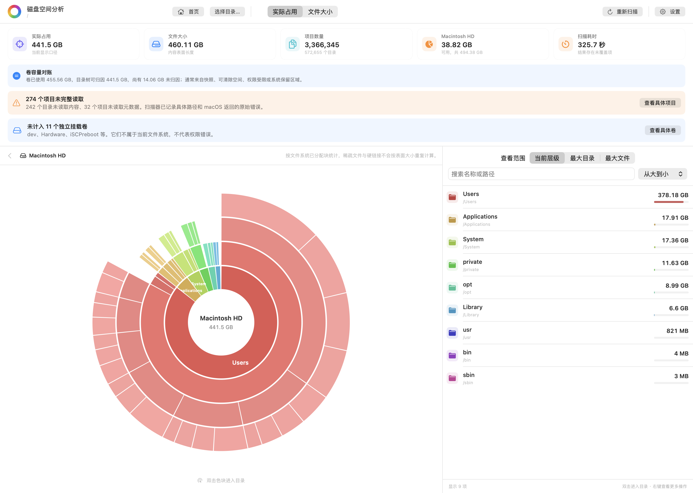

# 磁盘空间分析

[English](README.md) | **简体中文**

Disk Analyzer 是一款原生 macOS 磁盘空间分析工具。它把可交互的多层圆环图与目录、文件排行结合起来，并明确区分“磁盘实际分配空间”和“文件表面大小”，避免把稀疏文件、硬链接等情况展示成看似精确、实际却容易误解的单一总数。

应用可扫描启动磁盘、当前用户的个人目录、外置磁盘或任意文件夹。所有结果只留在本机；浏览分析结果不会修改文件。清理项目会先进入清理列表供核对，经过可取消的 5 秒倒计时后再移入系统废纸篓。

## 界面预览

[English screenshots](README.md#interface-preview) | **简体中文截图**

### 首页


### 分析结果



> 两张截图均由真实 SwiftUI 界面配合内置演示数据渲染。图中的名称、路径、大小、数量、诊断信息和扫描耗时均为演示内容，不来自任何用户的磁盘。

## 安装与运行

请按以下步骤从最新源码在本机构建。

> [!IMPORTANT]
> 打包脚本默认使用 ad-hoc 临时签名，且不会进行 Apple 公证，macOS 可能提示无法验证开发者。临时签名还会在可执行文件变化后生成新的代码身份，因此覆盖安装新版本后，可能需要先在“系统设置 → 隐私与安全性 → 完全磁盘访问权限”中删除旧的 DiskAnalyzer 条目，再重新添加 `/Applications/DiskAnalyzer.app`。

### 推荐：从源码构建

要求：macOS 13 或更高版本，以及 Xcode 或 Xcode Command Line Tools 附带的 Swift 工具链。

```bash
git clone https://github.com/daniel-weih/disk-analyzer.git
cd disk-analyzer
swift run
```

打包应用：

```bash
./scripts/package_app.sh
open dist/DiskAnalyzer.app
```

打包并校验 DMG：

```bash
./scripts/package_dmg.sh
open dist/DiskAnalyzer-2.2.0-arm64.dmg
```

把 `DiskAnalyzer.app` 拖入“应用程序”，推出安装镜像，再从“应用程序”启动。若首次启动被 Gatekeeper 拦截，可在 Finder 中按住 Control 点按应用并选择“打开”。

## 当前能力

- 可交互的多层圆环图，双击色块逐层进入目录
- 可在应用设置中即时切换简体中文和英文，并记住选择
- 当前层级、最大目录、最大文件三种排行范围
- 名称或路径搜索、大小/名称排序、Finder 定位和安全移入废纸篓
- 支持启动磁盘、个人目录、外置磁盘和任意文件夹
- 返回首页时保留最近一次分析结果和目录下钻位置
- 明确展示未读取目录和元数据错误，不把未覆盖路径静默记成 0
- 将主动跳过的挂载卷、文件系统边界与权限问题分开说明
- 单独展示卷容量对账，避免把快照、可清除空间和 APFS 共享块伪装成普通目录统计

## 统计口径

Disk Analyzer 提供两种口径：

- **实际占用**：使用 `lstat(2)` 返回的 `st_blocks × 512`，与 `du -sk` 的统计模型一致。稀疏文件只计算实际分配块，同一 inode 的硬链接只计一次。
- **文件大小**：使用 `st_size`，表示文件内容的表面长度。稀疏文件、硬链接和 APFS 克隆都可能让该总数大于物理占用。

扫描默认不跨文件系统。应用通过设备号和 inode 避免 APFS firmlink 重复路径，并优先在结果树中保留 `/Users`、`/Applications` 等容易理解的路径。

APFS 快照、可清除空间和克隆文件共享的底层 extent 无法始终精确归属到普通目录树，因此应用把“已扫描文件”和“卷容量”作为相互关联但不同的证据分别展示。

## 隐私与安全

- 不包含网络请求、分析 SDK、遥测、账号或云端存储
- 扫描结果只保存在当前进程内，不会持久化成浏览历史
- 扫描只读取名称、路径和文件系统元数据，不读取文件内容
- 清理项目会先在清理列表中核对，经过可取消的 5 秒倒计时后移入可恢复的系统废纸篓
- `/System` 等系统根目录和其他受保护的顶层位置不能从应用内移到废纸篓

## 完全磁盘访问权限

macOS 不允许应用自行授予完全磁盘访问权限。Disk Analyzer 会在广泛扫描前引导用户进入正确的系统设置页面，并通过只读访问受保护的 TCC 数据库来验证权限；仅仅打开设置或重启应用不会被误判成授权成功。

如果无法把应用拖入权限列表，可点击系统设置中的 `+`，选择 `/Applications/DiskAnalyzer.app`。使用稳定的 Apple Development 或 Developer ID 签名，可以避免每次构建后权限绑定的代码身份发生变化：

```bash
DISK_ANALYZER_SIGN_IDENTITY="Developer ID Application: Example (TEAMID)" \
  ./scripts/package_dmg.sh
```

## 开发与验证

```bash
swift build
./scripts/test.sh
```

重新生成 README 使用的英文和简体中文截图：

```bash
./scripts/capture_readme_images.sh
```

测试覆盖实际占用/文件大小统计、硬链接去重、稀疏文件、符号链接、省略文件聚合、不可读目录诊断、挂载卷分类、权限状态、首页/结果页导航、紧凑圆环布局和脱敏 UI 渲染。

## 许可证

Disk Analyzer 采用 [MIT License](LICENSE)。
